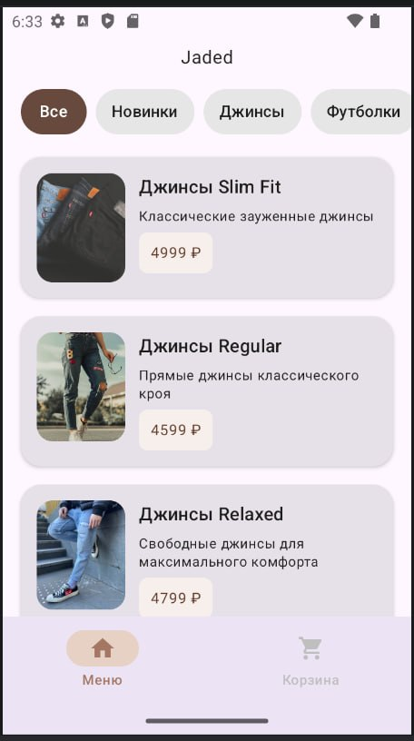
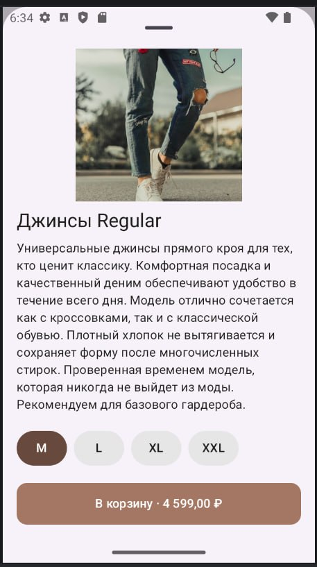
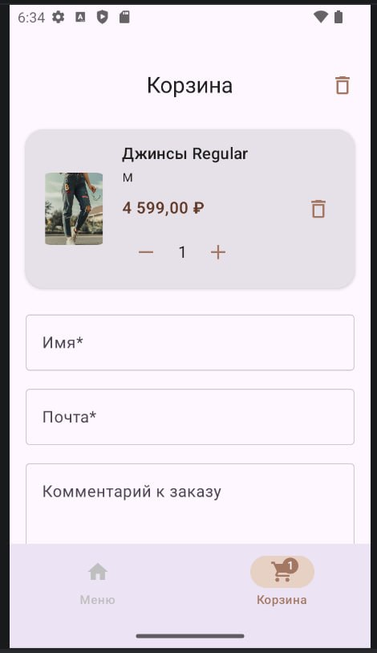
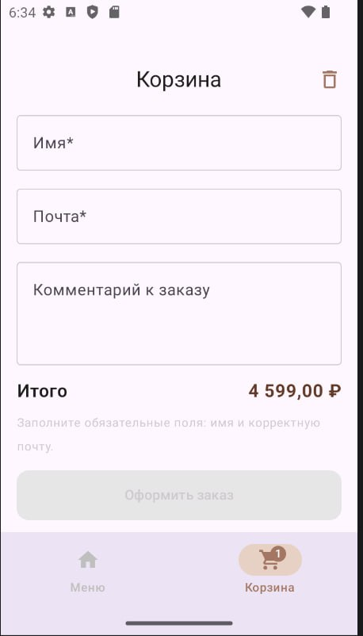

# team-kfc

Студенческий проект: team-kfc

# Jaded — мобильное приложение интернет-магазина одежды

> Учебный проект в рамках курса по разработке мобильных приложений  
> ДВФУ, 2026

## О проекте

Jaded — Android-приложение онлайн-магазина одежды.

Пользователь получает доступ к каталогу товаров с возможностью:

- фильтрации по типу, материалу, размеру и цене
- просмотра подробного описания и фотографий каждого изделия
- проверки наличия товара на складе
- добавления товаров в корзину и оформления заказа

## Команда

Путилина Екатерина - Designer  
Козлович Арина - Front-end
Труфанов Александр - Back-end

## Стек технологий

- Платформа: Android
- Язык: Kotlin
- IDE: Android Studio
- Сборка: Gradle (Kotlin DSL)

## Скриншоты

> Скриншоты основных экранов приложения

| 
| 
| 
| 

## Сборка и запуск

### Требования

- Android Studio Hedgehog (2023.1.1) или новее
- JDK 17+
- Android SDK (минимальная версия: указана в `app/build.gradle.kts`)
- Gradle 8.x (входит в комплект через `gradlew`)

### 1. Клонирование репозитория

```bash
git clone https://github.com/FEIP-FEFU-Mobile-Spring-2026/team-kfc.git
cd team-kfc
```

### 2. Открытие в Android Studio

1. Запустите Android Studio
2. Выберите File → Open
3. Укажите папку с проектом
4. Дождитесь завершения синхронизации Gradle

### 3. Сборка

Сборка запускается автоматически после синхронизации. Если нужно вручную:

```bash
# Debug-сборка
./gradlew assembleDebug

# Release-сборка
./gradlew assembleRelease

# Полная сборка
./gradlew build
```

Или через меню Android Studio: Build → Make Project

### 4. Запуск

На эмуляторе:

1. Откройте Device Manager
2. Создайте или запустите виртуальное устройство (AVD)
3. Нажмите Run ▶ и выберите эмулятор

На физическом устройстве:

1. Включите Режим разработчика в настройках устройства
2. Активируйте USB-отладку
3. Подключите устройство кабелем к компьютеру
4. Разрешите отладку на устройстве
5. Нажмите Run ▶ и выберите устройство

## Структура проекта

```
team-kfc/
├── app/
│   ├── src/
│   │   ├── main/
│   │   │   ├── java/       # Kotlin-код приложения
│   │   │   ├── res/        # Ресурсы (макеты, изображения, строки)
│   │   │   └── AndroidManifest.xml
│   │   └── test/           # Тесты
│   └── build.gradle.kts
├── gradle/
├── screenshots/
├── build.gradle.kts
├── settings.gradle.kts
└── README.md
```

## Чеклист выполненных лабораторных

См. [checklist.md](checklist.md)
